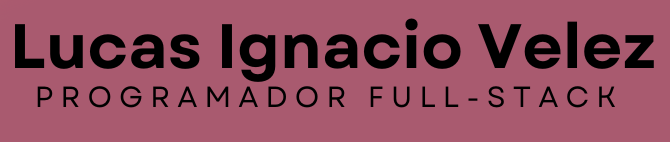

  

# 👋 ¡Hola! Soy Lucas  
### *Desarrollador Full Stack Jr. | Curioso. Perseverante. Amante del código limpio.*

🎯 Mi objetivo es construir software útil, escalable y claro, mientras sigo aprendiendo todos los días.

---

## 🌟 Sobre mí  
- 💻 Apuntando a un futuro en **programación y desarrollo de software**.
- 🚀 Me entusiasma aprender constantemente y aplicar buenas prácticas de desarrollo.  
- ⚽ Fanático del fútbol y los videojuegos.  

---

## 💻 Tecnologías que uso

### 👨‍💻 Lenguajes de programación  
🟪 C#    🐍 Python    ☕ Java    🟨 JavaScript  
🔵 TypeScript   🧊 C++   🧱 HTML / CSS  

### ⚙️ Frameworks y Librerías  
🛡️ Angular  🧪 JUnit  🎭 Mockito  🔩 .NET  

### 🧠 Bases de Datos  
🗄️ SQL Server  🌿 MongoDB  🌀 Cassandra  
🧠 Redis  🔷 Neo4j  

### 🧰 Entornos y Herramientas  
🧠 Visual Studio / VS Code  🧭 IntelliJ IDEA / WebStorm  
🔧 Git / GitHub  📊 SSMS  🧪 Swagger  🤖 Arduino

---

## 📊 Mis estadísticas en GitHub

  

---

## 🛠️ Proyectos Destacados  
### 📌 [SPA]: *Dot Dager Page*  
SPA creada con HTML, CSS y JS, utilizando Bootstrap 5, para el concurso del Youtuber "Dot Dager" ->
https://rainbow-queijadas-2ddace.netlify.app/

---

## 📞 Conectemos  
- 💼 LinkedIn: [Lucas Ignacio Velez]([www.linkedin.com/in/lucas-ignacio-velez-ba8889285](https://www.linkedin.com/in/lucas-ignacio-velez-ba8889285/))  
- 🌐 Visita mis proyectos en mi [GitHub](https://github.com/lucithub).  

📬 ¿Querés contactarme o ver más?  
Estoy abierto a colaboraciones, prácticas profesionales o simplemente charlar sobre desarrollo.
